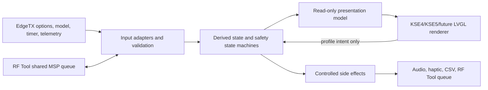

# KSE Future Widget Implementation Blueprint

> Implementation-grade reference for building a new visual dashboard without losing the behavior, safety rules, RotorFlight integration, and EdgeTX conventions established by KSE4 and KSE5.

## 1. Purpose and authority

This file is the handoff contract for future KSE widgets. It is intended to be given to Codex together with a visual idea, sketch, screenshot, or layout description. The new visual layer may be radically different, but the operational behavior described here must remain intact unless Kyle explicitly requests a functional change.

The current source files inspected for this blueprint are:

- `KSE4/main.lua`
- `KSE5/main.lua`
- `README.md`

This blueprint reflects those files as inspected on **2026-08-25**. The Lua files are the ultimate source of truth if this document and a later code revision ever disagree. Before implementing a future widget, compare the then-current KSE4 and KSE5 sources against this blueprint and carry forward any newer fixes.

KSE4 and KSE5 are functionally aligned but are not byte-for-byte copies. They deliberately present the same aircraft information in different ways:

- **KSE4** is an 800 × 480-reference panel dashboard with a model image, governor panel, large headspeed hero, four metric tiles, and a full-width battery bar. It has a large theme catalog and explicitly displays tail RPM.
- **KSE5** is a 480 × 320-reference ring-card dashboard with battery, headspeed, current, and temperature rings, a model panel, and a 2 × 2 lower metric grid. It keeps some telemetry available in the backend even when the current layout does not render it.

For a new widget, start with the complete current `main.lua` from whichever widget is the better structural base, rename widget-specific paths and identity, then replace the presentation layer. Do not re-create the backend from memory or from a short feature list. This document explains the contract and acceptance criteria; the proven source provides the implementation details.

### 1.1 What “same backend” means

A future visual variant is functionally correct only if it preserves all of the following:

1. The ten-setting schema, order, defaults, and legacy migration behavior.
2. Electric, Nitro, and OMPHOBBY telemetry contracts.
3. Current/fresh telemetry validation and legitimate-live-zero handling.
4. Battery percentage selection, reserve adjustment, smoothing rules, and LiHV fallback detection.
5. Voice and haptic alert state machines, including startup and replacement-pack behavior.
6. The telemetry-validated Motor Switch gate and its fail-open behavior.
7. KSE Counter/Timer 1 CSV behavior.
8. Read-only RotorFlight FC flight-counter behavior through RF Tool.
9. The single shared RF Tool MSP queue and all ownership protections.
10. Safe, verified, persistent battery-profile selection.
11. Read-only arming-blocker diagnostics.
12. Strictly display-only Sim Preview behavior.
13. Foreground/background service continuity, state resets, and retained rendering.
14. Responsive support and visual validation at 480 × 320, 480 × 272, and 800 × 480.

### 1.2 What a visual redesign may change

Without requesting a backend change, a future layout may change:

- Panel, ring, gauge, card, graph, and typography choices.
- Theme colors and visual decoration.
- The position and relative prominence of values.
- Which already-available noncritical telemetry values are visible.
- Short versus long captions at different resolutions.
- Whether the battery-profile entry target is a bar, ring, card, or dedicated button.
- Whether a modal uses the custom dialog or native menu on screens large enough to support either.

It may not silently change:

- A sensor name or mode contract.
- A validity range or safety threshold.
- The meaning of a warning color or `--`/`NO DATA` state.
- Any alert latch, acknowledgement rule, or timing.
- Any MSP command, order, retry behavior, timeout, or queue ownership rule.
- The definition or persistence of either flight counter.
- Which code is allowed to run during Sim Preview.
- The order or meaning of saved widget settings.

## 2. Non-negotiable invariants

These are the rules most likely to be accidentally broken during a visual rewrite.

### 2.1 One MSP transport owner

RF Tool is the sole owner of MSP framing, reply polling, and the shared queue. A KSE widget may register as a consumer, invisibly host the official RF Tool widget when necessary, add messages to RF Tool's queue, and service that queue through the published API. It must never create a parallel MSP transport or compete for CRSF/telemetry reply frames.

Never:

- Copy RF Tool's transport loop into the dashboard.
- Start a second RF Tool host when one already exists.
- Treat a standalone `rf2bg` core as a safe equivalent to RF Tool.
- Change the global queue retry policy or `rf2.mspQueue.maxRetries`.
- Replace `processQueue()` or other queue methods.
- Clear queue work belonging to another RF Tool consumer.

### 2.2 Profile persistence is a transaction

Selecting a RotorFlight battery profile is not complete when the runtime value changes. The successful transaction is:

```text
MSP 176 set zero-based profile
    -> MSP 175 read back active profile
        -> verify it equals the requested profile
            -> MSP 250 EEPROM commit
                -> wait for MSP 250 reply
                    -> report SAVED
```

If the `175` readback does not match, cancel the save. If `250` fails or times out, report that the profile may be active but was not saved. Never label an `MSP 176`-only result persistent.

### 2.3 A switch movement is not motor-stop proof

The configured Motor Switch is a whole physical switch source. Its movement is only a candidate event. Electric mode requires a correlated governor transition or independently valid stopped headspeed. OMPHOBBY requires prior running `NR` followed by sustained current zero. Missing, stale, contradictory, or malformed evidence must restore alerts, not suppress them.

### 2.4 Simulation has no side effects

Sim Preview is a renderer/data-preview mode. It must not:

- Start or service RF Tool.
- Register an RF Tool consumer.
- Queue or transmit MSP.
- Run either real flight counter.
- Create or write `/flights-count.csv`. Reading the existing KSE count once for visual fidelity is permitted, but preview must never advance or save it.
- Play WAV files or number speech.
- Trigger haptics.
- Run motor-gate, battery-alert, ESC/BEC-alert, Nitro-warning, or arming-diagnostic state machines.
- Use synthetic data to mutate live/persistent safety state.

Synthetic values belong only in the display/cache boundary. Leaving preview must clear preview state and resume live telemetry as a fresh session where required.

### 2.5 Runtime state and persistent state are different

Keep these distinctions explicit:

- `BAT#` telemetry is display data and can lag a controller write.
- MSP `176` changes controller runtime state.
- MSP `175` proves controller readback.
- MSP `250` persists nonvolatile state.
- `/flights-count.csv` is the KSE Counter's persistent store.
- MSP flight statistics are FC-owned persistent data and remain read-only to the widget.
- Session minimums/maximums are RAM-only and reset on the relevant session/model change.

### 2.6 Harness evidence is not radio proof

Desktop Lua parsing, mocks, layout harnesses, and deterministic bytecode comparisons are necessary development checks. They do not prove real CRSF/MSP timing, RF Tool initialization, SD-card behavior, audio queue timing, Lua memory headroom, touch behavior, or physical switch/sensor semantics. Report simulator/harness and physical-radio validation separately.

## 3. System architecture

The clean mental model is a four-layer pipeline:



The visual layer reads state and emits high-level intent such as “open profile picker” or “request profile 3.” It does not decide whether a write is safe, construct transport frames opportunistically, or own persistence.

### 3.1 Main state groups

The current code separates state by responsibility. Preserve these boundaries even if names change.

| Group | Ownership and purpose |
| --- | --- |
| `G` | Geometry helpers, resolution flags, discrete font selectors, layout signature, and shared layout calculations. KSE4 also uses it to stay under Lua's top-level local limit. |
| `OPT` | Parsed, normalized widget settings: helicopter type, battery mode, reserve, voice, counter source, simulation, receiver-pack range, transparency/theme. |
| `SRC` | User-mapped EdgeTX sources. Only the whole physical Motor Switch is manually mapped. |
| `F` | Per-frame/per-service cache for host reads such as time, model name, timer, telemetry, and formatted state. Cleared before each foreground/background pass. |
| `RESOLVED` | Cached telemetry source ids and the selected link-quality alias. Cleared on model/session changes and stale-source detection. |
| `D` | Current validated and derived display data plus validity flags. Examples: resolved cells, voltage, adjusted percentage, receiver voltage, per-source current validity. |
| `S` | Session extrema: maximum main RPM/current/temperature and minimum BEC/cell voltage. |
| `A` | Alert, evidence, link, motor-gate, pack-replacement, latching, acknowledgement, and timing state. |
| `FC` | Flight-counter source constants and RotorFlight FC read state: count, status, stale flag, arm/disarm evidence, refresh attempts, pending/wanted state. |
| `PROFILE_CONFIRMED` | Short-lived locally confirmed profile used to hide delayed `BAT#` telemetry after a successful controller transaction. |
| Widget instance fields | Zone, layout signature, retained UI state, simulation tick, RF Tool provider/host state, profile operations, dialog state, arming operation, and touch/menu state. |
| `V` or `widget.ui` | Retained LVGL object references. KSE4 is mostly module-wide; KSE5 keeps more renderer state on the widget. |
| `OBJECT_STATE` or `widget.objectState` | Last applied properties for diffed LVGL updates. |

### 3.2 Backend versus renderer boundary

Treat these functions/concepts as backend and port them intact:

- Option parsing and migration.
- File reading/writing, model keys, and CSV cache.
- Telemetry resolution, validation, and link logic.
- Battery selection/calculation.
- All voice/haptic/motor safety state machines.
- Timer and flight-count logic.
- RF Tool discovery, hosting, registration, queue ownership, MSP operations, arming status, and FC statistics.
- Simulation generation and, more importantly, its isolation boundary.
- Lifecycle reset decisions.

Treat these as renderer-specific and safe to replace carefully:

- Theme construction.
- `buildLayout()` or `G.configure()` geometry.
- `buildTopBar`, panel/ring/tile construction, battery visualization, image composition.
- Formatting and shortening of already-derived values.
- Retained object helpers, provided their change-detection behavior remains.
- Touch hit testing and modal composition, provided touch only raises a backend request.

## 4. Platform, dependencies, and file layout

### 4.1 Runtime environment

The widget targets RadioMaster TX15, GX15, TX16S MKII, and TX16S MK3 transmitters running EdgeTX with LVGL widget support and RotorFlight 2.3 telemetry. The required validation resolutions are:

| Class | Physical resolution | Current representative radio |
| --- | ---: | --- |
| Compact/taller | 480 × 320 | RadioMaster TX15 / GX15 |
| Compact/shorter | 480 × 272 | RadioMaster TX16S MKII |
| Large reference | 800 × 480 | RadioMaster TX16S MK3 |

Full-screen is preferred, but the code also accepts assigned zones and rebuilds when zone geometry or full-screen state changes.

### 4.2 Widget files

A future widget named `KSE6` would normally use:

```text
/WIDGETS/KSE6/
  main.lua
  main.luac                 # only when producing a radio deployment build
  default.png
  Rotorflight.png           # optional last-resort fallback
  BatterySounds/
    50%.wav
    40%.wav
    30%.wav
    20%.wav
    10%.wav
    0%.wav
    dead.wav
```

When cloning a visual variant, rename every widget-specific path, especially:

- Returned widget `name`.
- `BATTERY_VOICE.path`.
- Bundled fallback-image paths.
- Dialog titles and identity strings.
- Documentation and package directory.

Do not rename EdgeTX's entry filenames `main.lua` and `main.luac`.

The KSE source repository may intentionally be source-only. Do not add `main.luac` merely because it is mentioned here. For an SD-card/radio release, however, the installed source and bytecode must be a matched pair built from the same final source.

### 4.3 RF Tool dependency

Features requiring controller MSP use the official RotorFlight 2.3 EdgeTX Lua package:

```text
/WIDGETS/RfTool/app.lua
/SCRIPTS/RF2/
```

Expected published interfaces include:

- Global `rf2` table.
- RotorFlight MSP API version at least `12.09`.
- Shared `mspQueue` with `add()` and queue-processing support.
- `useApi()` modules such as `mspBatteryProfile`, `mspBatteryConfig`, `mspStatus`, and `mspFlightStats` where available.
- RF Tool widget consumer API version at least `1.00` and `registerWidget()` where available.

The dashboard can invisibly instantiate `/WIDGETS/RfTool/app.lua` in a 1 × 1 hidden zone if no provider is already active. It passes hidden model/state/telemetry options and services the returned widget's `background()` method. Discovery waits briefly before doing this so an existing provider can publish itself.

A separately enabled `rf2bg` special function is not a valid replacement. Its custom telemetry consumer can compete for response frames. Detect the standalone core and display `DISABLE rf2bg SPECIAL FUNCTION` instead of starting another transport.

The separate RF Stats widget is not a dependency. RotorFlight FC counting uses the `mspFlightStats` API from the RF2 package through RF Tool's shared runtime.

### 4.4 Root-level flight database

The KSE Counter's sole persistent file is:

```text
/flights-count.csv
```

It is intentionally SD-card-wide rather than widget-local. RotorFlight FC counter mode must not open, merge, create, or write it.

## 5. Widget settings contract

EdgeTX persists widget settings positionally. Preserve the exact order unless a deliberate migration is requested.

| Slot | Key | Display label | Type | Default | Range/choices | Backend meaning |
| ---: | --- | --- | --- | --- | --- | --- |
| 1 | `Theme` | Theme | `CHOICE` | 1 | Widget-specific theme list | Visual palette only. Do not reset safety state for a theme edit. |
| 2 | `TxBatt` | TX Battery | `CHOICE` | LiPo | LiPo, Li-Ion | Sets transmitter-gauge endpoints only. |
| 3 | `MinFlight` | KSE Counter Min (sec) | `VALUE` | 20 | -30 to 120 in current schema | Timer 1 threshold for KSE Counter. Negative values become absolute; anything below 1 becomes 1. |
| 4 | `HeliType` | Heli Type | `CHOICE` | Electric | Electric, Nitro, OMPHOBBY | Selects telemetry and alert contract. |
| 5 | `BattRsv` | Batt/Battery Reserve % | `VALUE` | 20 | 0 to 50 | Re-scales Electric/OMP usable percentage. |
| 6 | `BattVoice` | Battery Voice | `BOOL` | Off | Off/on | Enables percentage/dead voice; does not disable critical haptic state machines. |
| 7 | `RxPackMin` | Rx Pack Minimum | `STRING` | `6.60` | Parsed voltage | Nitro 0% and low-warning threshold. |
| 8 | `RxPackMax` | Rx Pack Maximum | `STRING` | `8.40` | Parsed voltage | Nitro 100% endpoint. |
| 9 | `MotorSw` | Motor Switch | `SOURCE` | SG | Whole physical switch | Candidate input for motor-off validation and post-latch dead-warning acknowledgement. Falls back to unset only when EdgeTX cannot resolve SG. |
| 10 | `CountSrc` | Flight Counter | `CHOICE` | RotorFlight FC | KSE Counter, Rotorflight FC/`RotorFlight`, Sim Preview | Combines real counter selection and isolated preview without adding an eleventh option. |

### 5.1 Legacy option compatibility

Slot 10 previously held a boolean `SimTelem`/`Simulate Telemetry`. If `CountSrc` is absent and the old boolean is true, map it to `SIM_PREVIEW`. Otherwise default absent or unknown values to RotorFlight FC. Keep compatibility aliases for older display labels where the current code accepts them.

### 5.2 Receiver voltage text parsing

`RxPackMin` and `RxPackMax` accept several historical forms:

- `6.6` or `6,6` → 6.6 V.
- `66` → 6.6 V, preserving old tenths-scale values.
- `660` → 6.6 V, preserving hundredths-scale values.

Reject malformed/nonpositive input. The complete Nitro range is valid only when:

- Minimum is at least 4.0 V.
- Maximum is at most 9.0 V.
- Maximum is at least 0.1 V above minimum.

Use 6.6/8.4 as display fallbacks, but retain an `rxPackValid=false` flag so the UI and alert logic expose invalid configuration instead of silently accepting it.

### 5.3 Physical Motor Switch validation

Accept a configured source as a physical switch when EdgeTX metadata/source names identify forms such as `SA` through `SZ` or `SWITCH <letter>`. On older supported firmware where source inspection is unavailable, a configured readable `SOURCE` is accepted as the compatibility fallback.

Never substitute a channel, logical switch, or individual switch-position condition. Normalize the raw whole-switch value to `-1`, `0`, or `1`. Invalid/unreadable configuration must display:

- `SELECT A PHYSICAL MOTOR SWITCH`, or
- `MOTOR SWITCH UNAVAILABLE`.

## 6. Telemetry adapter and source contracts

### 6.1 Exact RotorFlight sensor names

Sensor names are case-sensitive.

| Backend key | Sensor | Use |
| --- | --- | --- |
| `headspeed` | `Hspd` | Main RPM, session max, Electric stopped-RPM proof. |
| `tailHeadspeed` | `Tspd` | Tail RPM where rendered. |
| `becVoltage` | `Vbec` | Electric BEC, Nitro receiver pack, BEC/Nitro warnings. |
| `cellVoltage` | `Vcel` | Cell display/minimum, LiHV detection, voltage fallback, connected-pack evidence. |
| `cellCount` | `Cel#` | Electric pack header. |
| `current` | `Curr` | Current display/session max. Use the dedicated current sensor, not a different ESC-current alias. |
| `capacity` | `Capa` | Used mAh. Do not treat `Fuel` as capacity. |
| `batteryPercent` | `Bat%` | Authoritative FC charge estimate, including Smart Fuel output. |
| `escTemperature` | `Tesc` | ESC temperature/session max/high-temp haptic. |
| `governorMode` | `Gov` | Governor display and Electric motor-state proof. |
| `batteryProfile` | `BAT#` | User-facing active battery profile, 1 through 6. |
| `pidProfile` | `PID#` | User-facing PID profile, 1 through 6, for the top-bar status. |
| `rateProfile` | `RTE#` | User-facing rate profile, 1 through 6, for the top-bar status. |
| `packVoltage` | `Vbat` | Electric pack header and connected-pack evidence. |

### 6.2 Exact OMPHOBBY sensor names

| Backend key | Sensor | Use |
| --- | --- | --- |
| `headspeed` | `NR` | Main RPM, session max, OMP stopped-RPM proof. |
| `packVoltage` | `RxBt` | Pack voltage, pack validity, derived cell voltage. |
| `current` | `Curr` | Current display/session max. |
| `capacity` | `Capa` | Used mAh. |
| `batteryPercent` | `Bat%` | Preferred percentage after the OMP pack contract is valid. |
| `escTemperature` | `Tmp` | Temperature/session max/high-temp haptic. |

OMPHOBBY has no current contract for tail RPM, BEC, governor mode, battery profile, or PID bank. Those display states must remain unavailable rather than being invented.

### 6.3 OMP cell-count inference

OMPHOBBY cell count is inferred case-insensitively from the EdgeTX model name:

1. If the name contains `M2`, use 3S.
2. Else if it contains `M1`, use 2S.
3. Otherwise cell count is unresolved and pack data is invalid.

Check `M2` first if a malformed name contains both. Derived cell voltage is `RxBt / cell count` and must pass the same per-cell plausibility check.

### 6.4 Link and transmitter sources

Resolve link quality in this order and cache the winning alias:

1. `RQly`
2. `RQLY`
3. `LQ`
4. EdgeTX `getRSSI()`
5. `RSSI`

The transmitter battery uses `tx-voltage`. If its value is above 100, interpret it as millivolts and divide by 1000. Accept only 0 through 20 V after conversion.

### 6.5 Current/fresh source semantics

The adapter must distinguish these states:

- Sensor does not exist.
- Sensor exists but is stale/not current.
- Sensor is current with a legitimate zero.
- Sensor is current with a valid nonzero value.
- Sensor is current but malformed/implausible.

Preferred flow:

1. Resolve string names through `getFieldInfo()` and cache the numeric id.
2. Read through `getSourceValue()` when available.
3. Reject the value when `isCurrent == false`.
4. Keep `isFresh`/existence metadata distinct from the numeric value.
5. If a cached source becomes stale, discard its id so discovery/model changes can resolve a new one.
6. Use `getValue()` only as the compatibility fallback.

This distinction is critical because `getValue("missing-name")` may return zero, while zero is valid for current, RPM, governor OFF, and battery percentage.

### 6.6 Plausibility bounds

| Value | Accepted condition |
| --- | --- |
| Cell count | Integer 1–16; OMP inference yields 2 or 3. |
| Pack voltage | Greater than 0 and no more than `16 × 4.5 = 72 V`. |
| Cell voltage | Greater than 0 and no more than 4.5 V. |
| Battery percentage | 0–100 inclusive. |
| Capacity | 0–100,000 mAh for telemetry display. |
| Current | -500 to 1,000 A. |
| Temperature | -40 to 250 °C. |
| BEC/receiver voltage | Greater than 0 and no more than 30 V. |
| Main/tail RPM | 0–100,000 RPM. |
| `BAT#` | Integer 1–6 for current profile behavior. |
| `PID#` | Integer 1–6 for top-bar status. |
| Controller profile capacity | Integer 0–20,000 mAh. |
| TX voltage | Greater than 0 and no more than 20 V after conversion. |

Invalid/stale/missing telemetry sets its corresponding `D.*Valid` flag false and normally renders `--`, not numeric zero.

### 6.7 Link availability semantics

`A.linkAvailable` is not simply “link sensor > 0.” The rule is:

- Once a supported link source has produced a positive sample, it becomes authoritative. A later live zero means link unavailable.
- Before any link source has established itself, current valid aircraft telemetry may establish operational availability. Evidence includes battery/cell data, capacity, current, temperature, BEC, RPM, or recognized governor data.

This prevents a discovered-but-not-populated link sensor from disabling every alert, while still respecting a real later link-quality zero.

### 6.8 Per-frame cache

Clear `F` at the beginning of each `refresh()` and `background()` pass. Cache repeated reads during that pass, including:

- `getTime()`.
- Model name/model info.
- Timer 1.
- Every telemetry value.
- Resolved battery/profile values.

Do not let the cache survive a model/session reset or hide a source becoming stale.

## 7. Battery data pipeline

### 7.1 Mode-specific validity

#### Electric

Select raw battery percentage in this order:

1. Use a current, valid `Bat%` between 0 and 100.
2. A positive `Bat%` is sufficient by itself.
3. An exact `Bat%=0` is usable only when a live positive `Vcel` or `Vbat` proves a flight pack is connected. This prevents a USB-powered FC with no flight pack from appearing as a connected dead battery.
4. If `Bat%` is unusable, use the voltage-derived percentage from valid `Vcel`.

RotorFlight publishes its FC-side charge estimate through `Bat%`. When Smart Fuel is enabled, that sensor already includes the controller's selected estimate and its sag compensation/rate limiting. The widget must not poll or configure Smart Fuel over MSP and must not apply a second display filter to the FC result.

#### OMPHOBBY

Require the complete OMP pack contract first:

- Valid positive `RxBt`.
- M1/M2-derived cell count.
- Valid derived per-cell voltage at or below 4.5 V.

Then prefer valid current `Bat%`; otherwise use voltage-derived percentage. Do not accept a percentage by itself when the OMP voltage/cell contract is invalid.

#### Nitro

Do not run the Electric/OMP flight-pack percentage pipeline. Read the receiver pack solely from current valid `Vbec`. `Batt` is not a fallback. The displayed percentage is linear between `RxPackMin` and `RxPackMax`, clamped to 0–100.

The current CELL presentation assumes a two-cell receiver pack and shows `Vbec / 2`. This is a known behavioral assumption; do not silently change it in a visual-only project.

### 7.2 Voltage-derived percentage

Use the current fallback formulas:

```text
LiPo  = clamp((cellV - 3.30) / (4.20 - 3.30) * 100, 0, 100)
LiHV  = clamp((cellV - 3.30) / (4.35 - 3.30) * 100, 0, 100)
```

LiHV auto-detection requires ten consecutive valid 10 Hz samples above 4.22 V/cell, i.e. one continuous second. A missing/lower sample resets the confirmation counter until LiHV is latched. Once latched, it remains latched for that battery session.

This is a fallback estimate, not a chemistry-accurate discharge curve.

### 7.3 Reserve adjustment

Apply reserve after choosing raw percentage:

```text
adjusted = clamp((raw - reserve) / (100 - reserve) * 100, 0, 100)
```

If raw percentage is nonpositive, return zero. Reserve is normalized to 0–50 by the option parser.

Example with a 20% reserve:

| Raw | Adjusted |
| ---: | ---: |
| 100% | 100% |
| 80% | 75% |
| 60% | 50% |
| 40% | 25% |
| 20% | 0% |
| 10% | 0% |

All percentage alert thresholds use the unsmoothed adjusted percentage.

### 7.4 Display smoothing

- FC/Smart Fuel source (`pctSource == "fc"`): display adjusted percentage directly.
- OMP telemetry and voltage fallback: at each 10 Hz update use:

```text
display = display + (adjusted - display) * 0.15
```

Initialize directly on the first valid sample. Loss of valid battery data resets display initialization.

### 7.5 Pack replacement detection

Alert state is rearmed only after a sustained upward jump lasting one second (`100` EdgeTX ticks):

- FC-to-FC source: an increase of at least 1 percentage point, because RotorFlight Smart Fuel is expected to be monotonic within a battery session.
- Voltage/receiver-derived sources: either reach at least 95% from below 80%, or rise by at least 25 points and end at 60% or higher.
- A change between percentage source types is not treated as a replacement jump.

When confirmed, reset only the flight-pack alert scope, set the new previous percentage/source, and prime already-passed thresholds.

### 7.6 Derived/display state

At the end of a telemetry tick, maintain at least:

- `D.voltage`: validated pack voltage or 0.
- `D.cellsResolved`: validated count or 0.
- `D.capacity`: current used mAh or 0.
- `D.hasBattData`: selected flight-pack percentage is usable.
- `D.adjustedPercent`: unsmoothed reserve-adjusted value.
- `A.displayPercent` and `A.displayPercentInit`: visual percentage state.
- `D.isLiHV` and confirmation samples.
- `D.rxVoltage`, `D.rxCellVoltage`, `D.rxPercent`: Nitro state.
- Per-source validity flags independent from numeric fallbacks.

### 7.7 Color semantics

Keep semantic colors independent from decorative theme colors:

| State | Color |
| --- | --- |
| Battery percentage ≥ 50% | Green |
| Battery percentage 20–49% | Yellow |
| Battery percentage < 20% | Red |
| TX battery rounded percentage ≥ 51% | Green |
| TX battery rounded percentage 31–50% | Yellow |
| TX battery rounded percentage 0–30% | Red |
| Session cell minimum ≤ 3.50 V | Red |
| BEC < 4.8 V | Red |
| BEC 4.8 to < 5.1 V | Yellow |
| BEC ≥ 5.1 V | Normal text |
| Valid active/healthy governor state | Green family |
| Transitional governor state | Yellow family |
| Stopped/fault governor state | Red family |
| Autorotation/bailout/bypass | Blue family |

Decorative themes may restyle backgrounds and panels, but green/yellow/red/blue must retain operational meaning.

## 8. Voice and haptic alert state machines

EdgeTX `getTime()` units are 10 ms ticks. Every timing constant below is expressed in those ticks.

### 8.1 Audio assets and fallback

Flight-pack levels are `50, 40, 30, 20, 10, 0` percent. Attempt the widget-local WAV first:

```text
/WIDGETS/<WidgetName>/BatterySounds/<level>%.wav
```

Cache file existence. If a percentage WAV is absent, use `playNumber(level, UNIT_PERCENT, 0)` when available. `dead.wav` has no spoken-number equivalent.

Current cadence:

| Constant | Ticks | Meaning |
| --- | ---: | --- |
| `batteryAlertCooldown` | 220 | Minimum 2.2 s between percentage alerts. |
| `initialDelay` | 250 | Wait 2.5 s after 0% announcement before first repeating dead warning. |
| `repeatDelay` | 220 | Repeat dead warning every 2.2 s. |
| `replacementConfirm` | 100 | Require 1.0 s sustained replacement rise. |

### 8.2 Starting or reloading mid-flight

On the first valid percentage:

1. Store it as the previous percentage/source.
2. Mark every threshold already passed as played so old warnings do not replay.
3. Exception: if starting at confirmed zero, leave the zero threshold pending so the critical alert still occurs.

### 8.3 Threshold crossing and skipped levels

When voice is enabled and the cooldown permits:

1. Find the lowest unplayed threshold at or above the current adjusted percentage.
2. If telemetry skipped multiple thresholds, announce only the current lowest relevant one.
3. Mark all higher skipped thresholds played so they cannot form a backlog.
4. At zero, set `battZeroReached` and schedule `dead.wav` after the initial delay.

When voice is disabled, continue marking crossed thresholds as played. Turning voice on later must not announce an old backlog.

### 8.4 Connection-time zero qualification

On the first transition to an available link, set a “connection zero pending” state. A startup zero must remain continuously valid for 300 ticks (3.0 s) before it can trigger the zero haptic. Any positive percentage cancels the pending classifier. A telemetry gap resets its timer.

This only protects the ambiguous startup-zero case. A known positive-to-zero transition in the same connected session triggers immediately.

### 8.5 Critical battery haptics

The current battery haptic state machine has two patterns:

- Crossing from above 10% to 10% or below: two haptic bursts separated by 100 ticks.
- Crossing from above zero to zero, or confirming startup zero: aggressive haptic repeated every 18 ticks for 500 ticks.

Each pattern is one-shot per battery session until replacement-pack logic rearms it. Link loss pauses progression.

### 8.6 Repeating flight-pack dead warning

After zero is reached and the delay expires, repeat `dead.wav` while voice is enabled and the link is available.

The first successful `dead.wav` playback latches the whole Motor Switch position. Only a later movement to a different detent acknowledges repeats. Movement before the first successful playback cannot pre-acknowledge the warning.

This acknowledgement affects repeating voice only. It is intentionally separate from the telemetry-validated motor-off pause for all flight-pack voice/haptic processing.

### 8.7 ESC temperature haptic

| Rule | Value |
| --- | ---: |
| Trigger threshold | Above 110 °C |
| Continuous confirmation | 50 ticks / 0.5 s |
| Rearm threshold | Below 100 °C |

Trigger one haptic per armed condition. Reset the pending timer on invalid data/link loss. Keep the alert latched until the lower rearm threshold is crossed.

### 8.8 Low-BEC haptic

| Rule | Value |
| --- | ---: |
| Ignore readings below | 4.0 V |
| Trigger threshold | Below 4.8 V |
| Continuous confirmation | 50 ticks / 0.5 s |
| Rearm threshold | Above 5.0 V |

The 4.0 V minimum prevents USB leakage/no-powered-pack readings from producing a BEC or Nitro receiver-pack alert.

ESC and BEC haptics remain active independently from the Electric/OMP motor-off flight-pack pause.

### 8.9 Nitro receiver-pack warning

This state machine runs only in Nitro mode and only with a valid configured range.

1. Require current `Vbec >= 4.0 V`.
2. When `Vbec <= RxPackMin`, start a continuous-low timer.
3. Do not latch until low persists for 200 ticks (2.0 s).
4. After latching, haptic every 20 ticks (0.2 s) while unacknowledged.
5. If Battery Voice is enabled, repeat `dead.wav` every 220 ticks.
6. Capture the Motor Switch position when the warning latches.
7. A later switch movement acknowledges both voice and aggressive haptic.
8. Movement during the two-second pre-latch qualification does not count.
9. Voltage recovery rearms a future event only after the previous warning was acknowledged. An unacknowledged warning stays latched across recovery.

Electric/OMP percentage sounds must never run or remain latched in Nitro mode.

### 8.10 Alert reset scopes

Do not use one indiscriminate reset for every settings edit. The code distinguishes:

- `flight`: flight-pack percentage/voice/haptic/replacement/LiHV state.
- `rx`: Nitro receiver-pack low/latch/acknowledgement state.
- `all`: both scopes plus ESC/BEC alert latches.

A theme change or unrelated visual rebuild must not erase an active warning.

## 9. Motor Switch safety gate

### 9.1 Goal and fail-open policy

The motor gate pauses Electric/OMP flight-pack voice and haptic progression after a validated motor-off event. It does not pause telemetry display, session stats, ESC-temperature haptics, or BEC haptics.

“Fail open” here means alerts resume/remain enabled when proof is lost. If the switch becomes unreadable, link disappears, governor/RPM evidence becomes contradictory, or the proof no longer holds, release the pause and clear stale candidates.

### 9.2 Governor states

| Value | Name | Running proof | Stop transition | May hold a proven pause |
| ---: | --- | :---: | :---: | :---: |
| 0 | OFF |  | Yes | Yes |
| 1 | IDLE |  | No by itself | Yes after explicit proof |
| 2 | SPOOLUP | Yes |  |  |
| 3 | RECOVERY | Yes |  |  |
| 4 | ACTIVE | Yes |  |  |
| 5 | THR-OFF |  | Yes | Yes |
| 6 | LOST-HS |  | No | No |
| 7 | AUTOROT |  | Yes | Yes |
| 8 | BAILOUT | Yes |  |  |
| 9 | BYPASS | Yes |  |  |

Unknown current enum values are unsafe/malformed and must never be treated as stopped. A missing or stale `Gov` is different: it may permit the independent current-`Hspd` proof.

### 9.3 Switch candidate capture

Track:

- Previous and current normalized switch positions.
- Candidate origin/destination and candidate tick.
- Last switch position proven while governor/RPM was running.
- Governor transition and confirmation evidence.
- RPM zero-since evidence.
- The position and proof type that established a pause.

For three-position switches, intermediate detents must not erase the original position already proven by running telemetry.

### 9.4 Electric governor correlation

The primary Electric proof requires:

1. A current recognized running governor state.
2. A Motor Switch movement from the running-proven position.
3. A recognized transition into OFF, THR-OFF, or AUTOROT within 150 ticks (1.5 s) of the switch event.
4. The stopped state persists for 20 ticks (0.2 s).
5. The current switch position still equals the candidate destination.

IDLE may hold a pause when it follows sampled explicit stop evidence, but IDLE alone cannot start one.

### 9.5 Electric headspeed fallback

The independent fallback requires:

1. Current valid `Hspd >= 1` previously established at a known switch position.
2. A later Motor Switch movement from that running-proven position.
3. Current valid `Hspd < 1` continuously for 30 ticks (0.3 s).
4. The total movement-to-zero window is no more than 3000 ticks (30 s), allowing rotor coast-down/autorotation.
5. Current governor evidence does not contradict the stop. A running, LOST-HS, or unknown-current governor state blocks the fallback. Missing/stale governor data does not.

### 9.6 OMPHOBBY RPM proof

OMPHOBBY uses `NR` only:

1. Current valid `NR >= 1` proves the running position.
2. A later Motor Switch movement creates a candidate.
3. Current valid `NR < 1` continuously for 30 ticks (0.3 s) proves stop.
4. Candidate window is at most 3000 ticks (30 s).

Running `NR` during coast-down does not relabel the new switch position as the running origin while a valid stop candidate is pending.

### 9.7 Holding and releasing a pause

While paused:

- Any switch movement releases the pause.
- Electric governor proof releases if governor data becomes missing or leaves the allowed hold states.
- Electric RPM proof releases if current governor becomes contradictory, RPM becomes invalid, or `Hspd >= 1`.
- OMP proof releases if RPM becomes invalid or `NR >= 1`.
- Link loss or unreadable switch releases immediately.
- Nitro always releases this flight-pack pause because it uses a separate receiver-warning acknowledgement model.

When releasing after a long pause, shift scheduled alert timers forward by the paused duration so delayed/repeating timers do not all fire immediately. Do not alter the underlying battery percentage or displayed data.

## 10. Telemetry service loop and session statistics

### 10.1 Ten-hertz core loop

Real telemetry and safety logic run no faster than every 10 ticks (10 Hz). A normal pass is conceptually:

```text
clear per-frame cache
if enough time elapsed:
    service KSE Counter/model-change logic
    read and validate live telemetry
    establish link availability
    update derived battery state
    service motor gate
    service mode-specific alerts
    service ESC/BEC alerts
    update session extrema
service RF Tool/profile/arming/FC coordinator as applicable
update retained UI only for changed values
```

The RF Tool coordinator has its own pending-operation scheduling and must continue in foreground and background when the selected live features need it.

### 10.2 Foreground versus background

`refresh()`:

- Clears the cache.
- Detects zone/full-screen changes.
- Services real telemetry or simulation.
- Services RF Tool features only when live.
- Updates retained visible objects.
- Handles touch/menu events.

`background()`:

- Clears the cache.
- Continues the same real 10 Hz telemetry, alert, counter, and session-stat service.
- Continues required RF Tool operations without constructing visible UI.
- Runs isolated simulation only when preview is selected.

Background service ensures a session maximum/minimum does not depend on which telemetry page was visible.

### 10.3 Session extrema

Update only while link is available and source validity is true:

- `rpmMax`: positive main RPM maximum.
- `currMax`: current maximum.
- `tempMax`: temperature maximum.
- `becMin`: minimum valid BEC/receiver voltage.
- `cellMin`: minimum valid cell voltage.
- Nitro also maintains `D.minRxVoltage` in the core receiver-pack path.

Reset extrema on model change and helicopter/simulation session changes. Do not persist them.

## 11. KSE Counter: Timer 1 and CSV persistence

### 11.1 Timer semantics

The top-bar clock and KSE Counter both use EdgeTX Timer 1, exposed as `model.getTimer(0)`.

For display, show `abs(timer.value)` as `minutes:seconds`. Countdown overrun therefore currently appears without a minus sign.

For qualification:

```text
if timer.start > 0:
    elapsed = timer.start - timer.value
else:
    elapsed = timer.value
elapsed = max(0, elapsed)
```

This supports count-up and countdown timers.

### 11.2 Threshold-crossing rule

A flight is counted once when Timer 1 crosses from below the normalized minimum to at/above it:

1. `timerThresholdArmed` is true only after a below-threshold observation.
2. Remaining above the threshold cannot add more flights.
3. Timer 1 must return below the threshold to rearm another count.

This prevents repeated increments when the timer is left running. The widget does not start, stop, reset, or configure Timer 1.

### 11.3 Model keys and CSV format

Normalize the model name by trimming it and replacing commas with spaces. Empty names use `__default__`.

Current file format:

```csv
model_name,flight_count
# api_ver=1
Goblin RAW,123
M2 Explore,48
```

Reading behavior:

- Missing/empty file means an empty database.
- Ignore blank lines and `#` comments.
- Ignore the header row.
- Parse at most 200 entries.
- Nonnumeric counts become zero.

Writing behavior:

- KSE Counter mode only.
- Sort model keys for stable output.
- Rewrite the full in-memory table.
- Preserve an explicit `SAVE ERROR` state when the write fails.

### 11.4 Defensive file replacement

The current writer:

1. Writes `<path>.tmp`.
2. If the original exists and rename APIs are available, moves it to `<path>.bak`.
3. Renames the temp file into place.
4. Deletes the backup on success.
5. Attempts to restore the backup on failure.
6. Falls back to direct write when rename APIs are unavailable.

Treat `io.write()` returning `nil`/`false` as failure even if `pcall()` itself succeeded. Close success is also required.

### 11.5 Known CSV limitation

The database is cached and the full table is later rewritten. Two independent writers can overwrite one another's updates. One active KSE widget instance is the supported model. A future visual rewrite must not claim concurrent-write safety without implementing read-merge-write or a shared service.

## 12. RotorFlight FC flight counter

### 12.1 Ownership and read-only boundary

RotorFlight FC mode reads the controller's persistent flight statistics through RF Tool's shared queue and `mspFlightStats` API.

- Read command: **MSP 14**.
- Never send write-capable **MSP 15**.
- Never merge FC totals into `/flights-count.csv`.
- Never use Timer 1 to qualify an FC flight.

### 12.2 Preconditions

Require:

- Complete RotorFlight 2.3/RF Tool package.
- One valid RF Tool provider/host.
- Shared queue and `mspFlightStats.read()` API.
- Current `ARM` telemetry, unless RF Tool state already supplies an unambiguous armed/disarmed transition.
- Stable disarmed condition for 150 ticks (1.5 s).

### 12.3 Read scheduling

Schedule a read:

- After initial stable disarmed connection.
- After a real arm-to-disarm cycle.
- After reconnect/model/source reset when a fresh value is needed.

Cancel or defer when:

- Armed.
- Disconnected.
- Model changes.
- Counter source changes.
- Another KSE profile operation owns the shared operation slot.
- The RF Tool queue is not idle.

### 12.4 Bounded command behavior

Use RF Tool's API to construct the message, then identify only the new MSP 14 message added for this request. Decorate that message only:

- Set a very long `retryDelay` (`86400`) so RF Tool does not automatically retransmit it inside the widget's bounded window.
- Give it the widget's error handler.
- Use a 200-tick/two-second reply timeout.

Do not modify the queue's global retry behavior.

### 12.5 Reply validation and post-flight confirmation

A valid reply requires:

- `stats.statsEnabled.value == 1`.
- `stats.stats_total_flights.value` is a nonnegative integer.

After a real flight, FC nonvolatile/statistics state may settle after the first disarm read. If the returned count still equals the previous base, schedule another fresh read. Allow up to six confirmation reads. While confirming or after a failed refresh with an older count available, mark the old value stale instead of displaying it as current.

Representative status vocabulary includes:

- `STARTING`
- `WAITING`
- `ARMED`
- `LOADING`
- `CONFIRMING`
- `RETRYING`
- `AVAILABLE`
- `STATS OFF`
- `NO ARM SENSOR`
- `NO API`
- `NO REPLY`
- `BAD REPLY`
- `DISCONNECTED`
- `QUEUE ERROR`

The visual design may shorten these on compact screens, but it must distinguish loading/caution, stale, disabled, disconnected, and error states.

## 13. RF Tool provider and shared-queue coordinator

### 13.1 Provider discovery

Use normal `_G.rf2` lookup; firmware globals may be provided through the global lookup table and not by `rawget()` alone.

A usable provider has either:

- RF Tool consumer API `rfToolApiVersion >= 1.00` plus `registerWidget()`, or
- A recognized RF Tool core with a shared queue and either a widget instance or a recently live RF Tool marker.

The MSP API must be at least `12.09` before queue use.

The current code treats `rfToolInstanceSeenAt` as live only when the provider's `clock()` says it was seen within two seconds.

### 13.2 Hidden-host lifecycle

If no provider exists:

1. Wait `PROFILE_HOST_DISCOVERY = 20` ticks so an enabled background provider can publish.
2. Reject standalone `rf2bg` with a clear error.
3. Use `loadScript("/WIDGETS/RfTool/app.lua")`.
4. Instantiate the factory in a hidden 1 × 1 zone with model/state/telemetry hidden.
5. Require a returned table with `background()`.
6. Track the `rf2` core created by that host.
7. If a different provider later replaces the global, discard the stale host reference rather than servicing two cores.

Retry missing/failed host startup on a bounded cadence (currently 500 ticks), and expose status such as `INSTALL RF TOOL 2.3`, `RF TOOL HOST FAILED`, or `RF TOOL HOST ERROR`.

### 13.3 Registration and connection state

When consumer registration is available, provide `onStateChanged(widget, newState)` and register once per provider reference. If the provider reference changes, reset registration and connection-dependent state.

Recognized connected states are:

- `connected`
- `armed`
- `disarmed`

Older compatible providers may be inferred connected from their published core plus a live radio link.

### 13.4 Queue service priority

When a KSE-owned operation or arming diagnostic is pending, process the shared queue before ordinary host background service. Otherwise let RF Tool's normal `background()` own the service pass and process the queue only as needed.

This maintains prompt progress without creating a second service loop or starving other RF Tool work.

### 13.5 Operation ownership

Every KSE queue operation carries:

- Incrementing token.
- Kind.
- Optional target profile/model/refresh base.
- Start time and stage start time.
- Exact queue reference.
- Exact list of messages added for the operation.

Callbacks must verify the token and kind before mutating state. Late replies from cancelled/older operations are ignored.

When calling an RF Tool API:

1. Snapshot current and queued message identities.
2. Call the API.
3. Compare the queue after the call.
4. Record only newly added messages as operation-owned.

### 13.6 Safe cancellation

Call `queue.clear()` only if:

- The current message is nil or owned by the operation, and
- Every queued message is nil or owned by the operation.

If another consumer owns any message, do not clear. Wait or let the operation timeout without destroying unrelated work.

This same rule applies when yielding MSP 101 arming diagnostics to a due MSP 14 flight-stat read or when cancelling an optional active-capacity read for a user profile selection.

### 13.7 Queue faults and timeouts

Record a queue-processing fault and route it to the active operation. Do not leave `profileBusy` permanently latched.

Current timeout classes:

| Operation | Ticks | Time |
| --- | ---: | ---: |
| General/small read | 800 | 8 s |
| Profile selection transaction | 2000 | 20 s |
| Active-capacity MSP 130 | 300 | 3 s |
| Snapshot active-profile stage | 500 | 5 s |
| Snapshot capacity stage | 1200 | 12 s |
| KSE5 standalone capacity read | 400 | 4 s |
| Flight statistics MSP 14 | 200 | 2 s |
| Arming status MSP 101 | 200 | 2 s |

Timeout messages must distinguish “profile active but save failed/timed out” from “profile change not confirmed.”

## 14. Battery-profile subsystem

### 14.1 Scope

The interactive profile picker is live only in Electric mode. Nitro does not expose battery-profile writes, but it may keep RF Tool active for arming diagnostics or RotorFlight FC counting. OMPHOBBY disables RotorFlight profile and arming-diagnostic UI, while FC counting may still request RF Tool if explicitly selected.

RotorFlight exposes six slots:

- User/UI/`BAT#`: 1 through 6.
- MSP payload/readback: 0 through 5.

Convert explicitly at the boundary and validate both forms.

### 14.2 Commands

| Command | Purpose | Access |
| ---: | --- | --- |
| MSP 32 | Read battery configuration/capacities. | Read-only. |
| MSP 101 | Read arming-disable status. | Read-only. |
| MSP 130 | Read compact active battery state/capacity. | Read-only. |
| MSP 175 | Read active battery profile. | Read-only. |
| MSP 176 | Set active battery profile in runtime RAM. | Write, guarded. |
| MSP 250 | Commit controller settings to EEPROM. | Write, only after verified 175 readback. |

### 14.3 Initial connection/snapshot

After a new profile-capable connection:

1. Reset prior active/capacity/menu/notice state.
2. Wait 40 ticks (0.4 s) for the provider/controller to settle.
3. Require the shared queue to be idle.
4. Read active profile with MSP 175.
5. Read capacities with MSP 32.
6. Keep the operation busy until both stages finish or a stage timeout occurs.

Prefer RF Tool's `mspBatteryProfile` and `mspBatteryConfig` APIs where present. A compatible raw-message fallback is allowed on the same shared queue.

### 14.4 Capacity decoding

Controller profile capacities are display/auto-selection data, not a prerequisite for manual selection.

Rules:

- Every capacity must be an integer from 0 through 20,000 mAh.
- A complete snapshot contains all six capacities.
- Some API/core variants expose all six through a parsed `batteryCapacity` table indexed by zero-based profile.
- Current raw decoding checks six little-endian U16 values beginning at the known MSP 32 offsets.
- If only the active capacity is available, retain it as partial data but set `profileCapacitiesComplete=false`.
- MSP 130 provides a compact post-selection active capacity and profile identity; treat it as a best-effort enhancement after a successful commit.

Do not infer unused profiles from a partial MSP 32 reply.

### 14.5 Only-configured-profile auto-selection

Automatic selection is allowed only when:

1. All six capacities were received and validated.
2. Exactly one of the six is greater than zero.
3. The widget is connected and profile switching is not currently unsafe.
4. The selected profile is not already active.
5. No conflicting operation is busy.

If any capacity is missing/invalid, or zero/multiple profiles have positive capacity, do not auto-select.

If the sole configured profile is already active, display its capacity without writing.

### 14.6 Write safety gate

Before beginning a profile write, block on explicit unsafe evidence in this order:

- RF Tool state is `armed`.
- Current `ARM` telemetry is odd/armed.
- Current recognized governor state is SPOOLUP, RECOVERY, ACTIVE, BAILOUT, or BYPASS.
- Current valid headspeed is at least 1 RPM.

User-facing messages:

- `DISARM TO CHANGE PROFILE`
- `STOP GOVERNOR TO CHANGE PROFILE`
- `STOP ROTOR TO CHANGE PROFILE`

The current implementation intentionally does not create a permanent lock solely because an `ARM` sensor is missing; the provider state and other explicit unsafe telemetry still apply. Do not weaken any explicit block.

### 14.7 Persistent selection transaction

For requested user profile `P`:

1. Verify the shared queue is idle and no blocking operation is busy.
2. Create one tokenized `select` operation with target `P`.
3. Add MSP 176, MSP 175, and MSP 250 to the one sequential queue in that strict order. MSP 176 carries payload `{ P - 1 }`.
4. After the 176 reply, move operation stage from `set` to `verify` and update status.
5. Process the queued MSP 175 readback.
6. Validate an integer zero-based reply 0–5.
7. Convert to 1–6 and require it equals `P`.
8. On a mismatch, cancel the operation-owned queued commit before it can run and report failure.
9. Only a match sets `verified=true` and permits the queued MSP 250 commit stage to be treated as valid.
10. Only the successful MSP 250 reply ends the operation and reports `PROFILE P SAVED TO FC`.

All three messages remain on RF Tool's single shared queue and are tracked as one operation.

Failure cases:

| Failure | Required result |
| --- | --- |
| MSP 176 no reply | Profile change not confirmed; no saved claim. |
| MSP 175 invalid | Invalid profile reply; cancel owned messages if safe. |
| MSP 175 returns another profile | Report `FC REMAINS ON PROFILE X`; do not commit. |
| MSP 250 error | Report `PROFILE ACTIVE BUT SAVE FAILED`. |
| Save-stage timeout | Report `PROFILE ACTIVE BUT SAVE TIMED OUT`. |
| Queue fault | Report RF Tool queue error and clear busy state safely. |

### 14.8 Post-selection behavior

After MSP 250 succeeds:

- Store active display profile.
- Set the short `PROFILE_CONFIRMED` override and current tick.
- Request best-effort MSP 130 after the write transaction drains.
- Display success with known capacity, `CAPACITY NOT SET`, or `PERSISTS AFTER FC REBOOT`.

`BAT#` can trail MSP for a few telemetry frames. Use the confirmed value for up to 300 ticks (3 s), then return authority to live telemetry. Clear the override early when `BAT#` catches up.

Failure of the optional MSP 130 capacity read must not turn an already saved selection into a profile-selection error.

### 14.9 UI and touch behavior

On a normal new connection:

- Read active/capacities.
- If there is no single configured auto-selection, automatically show the picker once after the snapshot completes.
- Let the user reopen it by touching the battery visualization.
- KSE4 uses the bottom battery-bar hit area.
- KSE5 uses the battery ring/card hit area.

The future layout must provide an equally clear battery-profile entry target in Electric mode.

Use the native `lvgl.menu()` when the zone is narrower than 430 px, shorter than 300 px, or custom dialog support is unavailable. Larger zones may use the custom dialog. The menu/dialog must show:

- Only P1–P6 slots whose capacity snapshot reports a positive configured capacity.
- `NO CONFIGURED PROFILES` when no slot has a positive configured capacity.
- Active profile.
- Pending profile.
- Configured capacity when available.
- Lock reason when unsafe.
- Close action.
- Optional capacity refresh action on layouts that provide it.

Touch only sets `profileSelectionRequested`; the backend service rechecks transport and safety before queuing anything.

## 15. Arming-blocker diagnostics

### 15.1 Read-only contract

The banner reads `mspStatus`/MSP 101 through RF Tool. It never changes arming state or clears controller flags.

Run in live Electric and Nitro modes. Disable and clear the banner in OMPHOBBY and Sim Preview.

### 15.2 Schedule

- Normal interval: 100 ticks / 1 s.
- Reply timeout: 200 ticks / 2 s.
- Stale display timeout: 500 ticks / 5 s.
- Decorate only the widget-owned MSP 101 with `retryDelay=86400` and its error handler.
- Do not start while another profile operation is busy.
- Yield an owned-only MSP 101 operation when an MSP 14 flight-stat read becomes due.

### 15.3 Flag interpretation

Known displayed flag names for bits 0–24 include:

| Bit | Label | Bit | Label |
| ---: | --- | ---: | --- |
| 0 | NO GYRO | 13 | CLI |
| 1 | FAILSAFE | 14 | CMS MENU |
| 2 | RX FAILSAFE | 15 | BST |
| 3 | RX RECOVERY | 16 | MSP |
| 4 | FAILSAFE MODE | 17 | PARALYZE |
| 5 | GOVERNOR | 18 | GPS |
| 6 | RPM SIGNAL | 19 | RESCUE |
| 7 | THROTTLE | 20 | RPM FILTER |
| 8 | ANGLE | 21 | REBOOT REQUIRED |
| 9 | BOOT GRACE | 22 | DSHOT |
| 10 | PREARM | 23 | ACC CAL |
| 11 | CPU LOAD | 24 | MOTOR PROTOCOL |
| 12 | CALIBRATING |  |  |

`ARM_SWITCH` is bit 26 and is the normal idle reason, so it is not itself displayed in the actionable list.

RotorFlight first-arm gyro calibration can report `CALIBRATING` while disarmed without `ARM_SWITCH`. Suppress CALIBRATING in that idle-only case. If CALIBRATING and ARM_SWITCH are both set during an arm attempt, retain CALIBRATING as a real blocker.

Show at most two named blockers plus `+N` for additional reasons:

```text
ARMING BLOCKED: RX FAILSAFE, THROTTLE +2
```

The banner is an overlay and must fit every target resolution without hiding critical primary values for longer than necessary.

## 16. Sim Preview contract

### 16.1 Entry and source selection

Sim Preview is the third value in `CountSrc`; it is not a separate eleventh setting. `OPT.simTelemetry` is derived exclusively from this selection or the legacy migration alias.

The selected `HeliType` still controls which synthetic sensors are considered available so each mode can be reviewed honestly:

- Electric: main/tail RPM, governor, battery, current, capacity, cell count/voltage, BEC, temperature, battery/PID/rate profiles, link, and TX battery.
- Nitro: main/tail RPM, governor, receiver battery, derived receiver cell voltage, link, and TX battery; current/temperature remain unavailable.
- OMPHOBBY: main RPM, Rx pack, derived 3S cell voltage, current, capacity, percentage, temperature, link, and TX battery; governor/tail/BEC/profile stay unavailable.

### 16.2 Synthetic cycle

The current preview uses a 36-second cycle (`3600` ticks) with a sine-like load variation and distinct stopped/spool/run/recovery/autorotation regions. Representative state includes:

- Battery drain from about 96% toward 22% raw.
- Rotor/current ramp while “running.”
- Temperature increase.
- Governor OFF → SPOOLUP → ACTIVE → RECOVERY → AUTOROT.
- Plausible TX voltage/link values.
- Fixed representative session extrema.

Exact preview numbers may change for a new visual concept, but mode validity and side-effect isolation may not.

### 16.3 Hard isolation implementation

The safest structure, used explicitly by KSE4, is:

```lua
if OPT.simTelemetry then
  serviceSimulation(widget)
else
  serviceTelemetry(true)
  batteryProfiles.service(widget, ...)
end
```

KSE5 also gates profile/RF Tool access internally, but a future widget should prefer the obvious outer separation so a later backend edit cannot accidentally run live side effects in preview.

The simulation function populates only display/validity/cache state and returns. It must not call `tick()`, `tickFlightCount()`, or any side-effecting service.

## 17. Lifecycle and reset matrix

### 17.1 `create(zone, options)`

The create path should:

1. Clear the frame cache before reading model-dependent state.
2. Parse options.
3. If KSE Counter/Sim Preview is selected, load the current model's radio CSV count; if RotorFlight FC is selected, initialize its model/state without opening the CSV.
4. Reset session stats/evidence for a fresh instance.
5. Build initial zone geometry and signature.
6. Initialize widget instance fields for simulation, provider/profile/menu state, and retained UI.
7. Notify the flight-counter coordinator of the selected source.

The supported deployment remains one active instance. Do not accidentally imply multi-instance safety.

### 17.2 `update(widget, options)`

Capture old behavior-affecting settings before parsing new ones, then use the following reset matrix.

| Change | Required reset/preservation |
| --- | --- |
| Theme only | Rebuild UI; preserve alerts, profile state, counters, and session evidence. |
| TX chemistry only | Rebuild/update TX gauge; preserve aircraft alert state. |
| Minimum flight time | Use new threshold; do not invent a flight increment during the edit. |
| Helicopter type | Reset session stats and all live telemetry/evidence; reset profile connection; clear mode-specific battery/Rx state. |
| Reserve | Reset flight-pack alert scope and display smoothing because threshold meaning changed; preserve Nitro and unrelated alert state. |
| Battery Voice toggle | Preserve threshold history so enabling it does not replay old levels. |
| Rx min/max validity | Reset Nitro receiver alert scope and receiver-derived display state. |
| Motor Switch | Reset motor-gate evidence; if an unacknowledged dead warning is latched, clear only its captured starting position so the newly configured switch can establish a valid post-change position. |
| Counter source | Load/initialize the correct source, reset Timer threshold as appropriate, cancel old FC work, and notify the shared coordinator. |
| Enter/leave Sim Preview | Reset session/evidence, simulation tick, relevant alerts, profile/RF Tool state, and derived battery/Rx data. |

After applying state changes:

- Set `A.lastDataTick=-1` so the next real pass is not delayed.
- Clear the frame cache.
- Rebuild geometry/UI.

### 17.3 `refresh(widget, event, touchState)`

Use `event ~= nil` as the existing indication of full-screen behavior, recompute physical bounds, and rebuild only when the `x:y:w:h` signature changes. Keep normal refresh read/update-only apart from high-level touch intent.

### 17.4 `background(widget)`

Keep telemetry, stats, alerts, CSV counting, and required RF Tool operations alive. Do not create or update visual objects in the background path.

### 17.5 Model change

When normalized model name changes:

- Switch KSE CSV key or reset FC model/request state.
- Reset Timer threshold rearming.
- Reset session stats/evidence.
- Clear resolved sensor ids/link alias.
- Resolve a new model image.
- Cancel/ignore old tokenized controller callbacks tied to the prior model.

## 18. Renderer data contract

A future renderer should consume normalized state rather than interpreting raw telemetry itself.

### 18.1 Always-available presentation fields

| Field | Presentation rule |
| --- | --- |
| Model name | Trim/shorten visually only; keep normalized full name for persistence/image lookup. Prefix `SIM ·` in preview. |
| Timer 1 | `abs(seconds)` formatted `m:ss`. |
| Link | Four bars at 20/40/60/80 boundaries. |
| TX battery | Bottom-to-top gauge, LiPo/Li-Ion linear mapping, no required percentage text. |
| Flight count/status | KSE numeric count + save error, or FC numeric/stale/status. Append RF Tool `Connected` status where current designs do. |
| PID/rate profiles | Show only when both `PID#` and `RTE#` are validated and the link is available; format currently `Profile N / Rate N`. |
| Battery profile | Show validated `BAT#` with the Electric battery display: above KSE4's battery bar or inside KSE5's battery ring. |
| Model image | Fixed lookup order, aspect-preserving `fill=false`, visible fallback text. |

### 18.2 Mode-dependent fields

| Display concept | Electric | Nitro | OMPHOBBY |
| --- | --- | --- | --- |
| Battery percentage | Adjusted FC/fallback percentage | Rx range-derived percentage | Adjusted OMP/fallback percentage |
| Main RPM | `Hspd` | `Hspd` | `NR` |
| Tail RPM | `Tspd` when layout renders it | `Tspd` when layout renders it | Unavailable |
| Governor | RotorFlight enum | RotorFlight enum | Unavailable |
| Current | `Curr` | Unavailable/`--` | `Curr` |
| Cell | `Vcel` | `Vbec / 2` | `RxBt / M1/M2 cells` |
| BEC/BATT output | `Vbec` as BEC | `Vbec` as receiver battery | Unavailable |
| Temperature | `Tesc` | Unavailable/`--` | `Tmp` |
| Used capacity | `Capa` | Normally unavailable | `Capa` |
| Profile picker | Enabled | Disabled | Disabled |
| Arming banner | Enabled | Enabled | Disabled |

### 18.3 Missing versus stopped values

Render valid live zero as `0`. Render missing/stale/invalid as `--` or a contextual `NO DATA`/`NO SENSOR` message. Do not collapse these states:

- `Hspd=0` with current telemetry means stopped.
- Missing `Hspd` means unknown and cannot prove motor stop.
- `Gov=0` means OFF.
- Missing/unknown `Gov` means `--`.
- `Bat%=0` can be a valid dead pack only with connected-pack evidence in Electric mode.

### 18.4 Critical warning precedence

The renderer must give configuration/safety messages precedence over decorative details:

1. Motor Switch configuration warning.
2. Invalid Nitro Rx range warning where applicable.
3. Arming blocker banner.
4. Active profile operation/save error.
5. Missing battery data or M1/M2 model-name requirement.
6. Ordinary telemetry captions.

Do not hide a critical warning solely because a narrow layout cannot fit the long caption; shorten it deliberately and retain its meaning.

## 19. Current front-end reference designs

### 19.1 Shared UI behavior

Both renderers provide:

- Model name and Timer 1 in the top bar.
- Four-bar link-quality glyph immediately left of a vertical TX battery.
- Optional `Profile N / Rate N` top-bar status from `PID#` and `RTE#`.
- Active `BAT#` status in the Electric battery display.
- Model image with flight-count footer.
- Governor, battery, main RPM, current, cell, BEC/receiver pack, capacity, and temperature representation appropriate to the chosen design.
- Profile picker entry from the primary battery visualization.
- Centered transient profile prompts/notices.
- Read-only arming-blocker overlay.
- Retained LVGL objects with diffed property updates.

### 19.2 KSE4 layout contract

Reference coordinate system: **800 × 480**, with independently scaled X/Y geometry.

Primary regions:

| Region | Reference geometry/purpose |
| --- | --- |
| Top bar | Model, timer, PID/rate profiles, link, TX battery. |
| Upper-left model panel | Model image plus flight-count/RF status footer. |
| Lower-left governor panel | Large state label with semantic panel color. |
| Upper-right headspeed hero | Main RPM, session max, tail RPM. |
| Middle-right four-tile row | AMPS, CELL, BEC/BATT, ESC T. |
| Bottom full-width battery | Header, percentage/receiver fill, extrema/range/ticks, and touch entry. |

KSE4-specific presentation rules:

- `G.compact` at width ≤ 520.
- Both 480-wide targets get compact captions.
- 480 × 320 and 480 × 272 need different text fitting despite equal width.
- Main RPM uses the largest safe discrete font; supported compact full-screen targets retain an XXL-style hero.
- On compact layouts, combine `MAX value` and `TAIL value` to avoid wrapping.
- On 800 × 480, pair smaller max/tail captions with `MIDSIZE` values using explicit gaps and centering.
- Four metric tiles center values deliberately at target font heights.
- The battery percent label is centered in the filled portion and hidden when the fill is too narrow.
- KSE4 themes include Dark, Light, two transparent modes, six monochromatic colors, and multiple specialty palettes. Preserve saved theme indices when adding themes; append new values.

### 19.3 KSE5 layout contract

Reference coordinate system: **480 × 320**, also scaling independently to 480 × 272 and 800 × 480.

Primary regions:

| Region | Purpose |
| --- | --- |
| Top bar | Model, timer, PID/rate profiles, four-bar link, TX battery. |
| Four equal ring cards | Battery %, main RPM, current, ESC temperature. |
| Lower-left double-width panel | Model image and flight-count/RF status. |
| Lower-right 2 × 2 grid | GOV MODE, BEC/BATT OUTPUT, CELL VOLT, USED CAPACITY. |

KSE5-specific presentation rules:

- Bottom grid has a fixed compact minimum so 480 × 272 still fits two rows using discrete EdgeTX fonts.
- Ring radius/thickness derive from card dimensions and available vertical room.
- Arc geometry is immutable after creation. Dynamic functions provide end angle/color/opacity because `object:set()` on arc angles can displace geometry on EdgeTX.
- Ring tracks remain full circles; current sweep begins at the six-o'clock EdgeTX angle convention.
- Current ring standards are approximately RPM 500–2400, current 0–250 A, and temperature 32–100 °C. Values clamp visually but the text still shows the actual validated number.
- KSE5 currently offers Dark, Light, Arctic Blue, Midnight Violet, and Orange.
- Governor value centers differently in compact tiles because `BOLD` is a discrete 20 px EdgeTX font, not a style bit.
- Tail RPM remains available in backend state but is not part of the current visible KSE5 card/grid layout.

### 19.4 Front-end flexibility rule

The new visual design does not need to resemble either reference. It does need to make all critical states discoverable:

- Link and TX battery.
- Main aircraft battery/Rx battery status.
- Main RPM and governor state where supported.
- Flight count/status.
- Motor Switch/Rx configuration errors.
- Profile connection/transaction feedback and an entry target.
- Arming blocker overlay.
- Clear missing/stale telemetry states.

Noncritical values such as tail RPM may be moved to a secondary view or omitted from a particular visual layout only if the user requests that presentation tradeoff; the backend should remain capable of reading them.

## 20. Responsive layout and EdgeTX font rules

### 20.1 Geometry

Use the actual zone/full-screen bounds:

- Full-screen: origin `(0,0)` and physical `LCD_W × LCD_H`.
- Zone: `zone.x`, `zone.y`, positive `zone.w`, `zone.h` with physical-screen fallbacks.

Maintain a layout signature from `x:y:w:h`. Rebuild the retained tree only when the signature or options requiring different objects change.

Use separate `scaleX` and `scaleY`; radios with the same width can have different height. Use `scaleMin` for radii/strokes/insets where distortion would be undesirable.

### 20.2 Discrete fonts

EdgeTX font constants are selectors, not CSS-like style flags.

Never assume:

```lua
SMLSIZE + BOLD
```

means “small bold.” It may select an unintended larger font. Choose exactly one of `SMLSIZE`, `BOLD`, `MIDSIZE`, `DBLSIZE`, `XXLSIZE` as supported. Use separate layout branches when a font step changes text height.

Access firmware globals through normal `_G[name]` fallback when necessary; `rawget(_G, name)` alone can miss values exposed through EdgeTX's read-only global lookup behavior.

Use EdgeTX's public `CENTER` name as the preferred source for centered alignment and retain compatibility fallbacks. Incorrect lookup silently left-aligns labels.

### 20.3 Required visual validation

For each 480 × 320, 480 × 272, and 800 × 480 target, validate more than rectangles:

- Five-digit main/tail RPM values.
- Long model names and truncation.
- `Profile 6 / Rate 6`.
- Largest FC/KSE counts and `SAVE ERROR`/stale suffixes.
- Long Motor Switch and Rx-range warnings.
- Two arming reasons plus `+N`.
- All governor words: `SPOOLUP`, `RECOVERY`, `THR-OFF`, `LOST-HS`, `AUTOROT`/`AUTO`, `BAILOUT`, `BYPASS`.
- `PROFILE ACTIVE BUT SAVE TIMED OUT` or compact equivalent.
- Percent, voltage, mAh, and temperature extrema.
- Text baselines, wrapping, clipping, and alignment.
- Modal bounds and every touch target.
- Battery fill labels at 0%, narrow fill, and 100%.
- Full-screen enter/exit and assigned-zone origin offsets.

Geometry-only tests are insufficient because an LVGL object's box can fit while the bitmap font is visibly clipped or shifted.

### 20.4 Touch targets and profile modal

- Make the battery entry target large enough for radio touch use, not merely a small label.
- Bound hit tests to the widget's actual origin and current layout.
- Ensure custom dialogs fit 800 × 480 and 480 × 320.
- Use native menu on 480 × 272 or other constrained zones when the custom dialog would be cramped.
- Re-run the safety check after the press and before queuing the write.

## 21. Model image contract

Sanitize the model name by replacing `\ / : * ? " < > |` with underscores before using it in a path. Do not concatenate raw model text into an SD path.

Lookup order for a future widget `<WidgetName>`:

1. `/IMAGES/<sanitized model name>.png`
2. `/IMAGES/<sanitized model name>.bmp`
3. `/WIDGETS/<WidgetName>/default.png`
4. `/IMAGES/default.png`
5. `/IMAGES/defaultmodel.png`
6. `/WIDGETS/<WidgetName>/Rotorflight.png`

Probe with `io.open()` in the fixed order. Cache by model name. Render with `fill=false` to preserve aspect ratio and avoid forced cropping. Show a visible `NO IMAGE`/`no model image` state when nothing resolves.

Changing image files without changing the model may require a widget reload because the chosen path is cached.

## 22. Retained rendering and resource constraints

### 22.1 Retained objects

Build static LVGL panels, labels, lines, arcs, and images only during initial construction, geometry changes, or option changes requiring different objects. Normal refresh updates existing objects.

Store the last applied properties for every object. Call `object:set()` only when at least one property changed. Hide/show only when visibility changes.

This matters on EdgeTX: rebuilding the whole tree every frame increases CPU, memory churn, flicker risk, and modal instability.

### 22.2 Processing budget

Preserve:

- 10 Hz telemetry/alert loop.
- Per-frame host-read caching.
- Cached sensor ids/aliases.
- Cached formatted strings where useful.
- Background session-stat updates.
- No interval-polling MSP outside the scheduled diagnostics/FC/profile operations.

### 22.3 Lua local-variable limit

EdgeTX Lua has a top-level local limit near 200. Large responsive refactors can fail with `too many local variables` even when logic is correct.

Use grouped tables (`G`, `FC`, a profile subsystem closure, widget instance state) instead of adding many top-level locals. Do not “solve” the limit by deleting validation or safety state.

### 22.4 One active instance

Both widgets retain substantial module-wide state. The current supported deployment is one active instance of the widget. Multiple simultaneous instances can interfere through options, caches, stats, alerts, geometry, or shared UI references. A visual-only successor should retain the one-instance statement unless it deliberately moves all state per-widget and validates the RF Tool/CSV implications.

## 23. Implementation procedure for a future widget

### 23.1 Before editing

1. Confirm the workspace, checkout, branch, and dirty state.
2. Read current `KSE4/main.lua`, `KSE5/main.lua`, and this blueprint.
3. Decide which current widget is the backend base. State the choice and why.
4. Treat the other current widget as a read-only cross-check unless Kyle explicitly authorizes edits to it.
5. Inventory source-only versus radio-deployment artifact expectations.
6. Record the exact target widget name and directory.
7. Preserve unrelated files and existing user changes.

### 23.2 Recommended port strategy

Use this order:

1. Copy the complete selected `main.lua` into the new directory.
2. Rename widget identity, sound paths, fallback-image paths, and dialog titles.
3. Parse/compile immediately before changing behavior. This creates a clean renamed baseline.
4. Mark the backend/rendering boundary in the working plan.
5. Replace only geometry, theme, retained-object construction, value formatting, and touch hit areas.
6. Keep option parsing, telemetry, battery, alerts, motor gate, counters, RF Tool, profile transactions, arming diagnostics, simulation isolation, and lifecycle resets intact.
7. If moving values between views, keep their source/validity semantics and missing-data states.
8. Run the backend tests before visual polishing.
9. Run text/layout/touch tests at all three target resolutions.
10. Rebuild deployment bytecode only from the final source, if bytecode is in scope.

### 23.3 Do not use copy-and-delete refactoring blindly

KSE4 and KSE5 contain similar functions but not necessarily identical current improvements. When replacing a section:

- Diff function-by-function.
- Keep the chosen base's complete state variables and reset sites.
- Check every callback and late-reply token guard.
- Search for widget-specific paths and old identity strings.
- Search every call site before removing a value from the UI.
- Keep the inactive legacy/commented KSE4 FC block inactive; do not resurrect it instead of the current shared coordinator.

### 23.4 Visual requests should become a presentation mapping

Before coding a new mockup, write a short mapping such as:

| Requested visual element | Existing state/source | Validity/missing state | Interaction |
| --- | --- | --- | --- |
| Large central rotor dial | `getHeadspeed()`, `D.rpmValid`, `S.rpmMax` | `--` if invalid; live 0 if stopped | None |
| Battery ribbon | `A.displayPercent` or `D.rxPercent` | `NO DATA`, Rx config warning | Opens profile picker only in Electric mode |
| Status chip | `getGovState()`, governor validity | `--` for missing/unknown | None |
| Flight history badge | KSE count or `FC.count/status/stale` | Save error/FC state | None |

This makes a new layout a renderer over the proven domain model instead of a second implementation of it.

## 24. Verification matrix

No single test proves this widget. Use layered verification.

### 24.1 Static/source checks

- Lua 5.3.6 syntax parses.
- No `too many local variables` compile error.
- No widget-specific old paths or identity strings remain in the successor.
- Ten options remain in exact order.
- `CountSrc` legacy migration remains.
- Sim Preview branch does not call live service or RF Tool.
- No MSP 15 anywhere in active code.
- MSP 176 is followed by 175 verification and 250 commit.
- MSP writes are reachable only through the guarded profile operation.
- Queue cancellation checks operation ownership.
- No global queue retry policy is changed.
- No second transport implementation is introduced.
- KSE CSV writes are restricted to KSE Counter mode.
- RotorFlight FC mode does not open/write the CSV.

Suggested source searches after a future port:

```bash
rg -n 'MSP_|command=|queue:add|queue.clear|processQueue|maxRetries' <Widget>/main.lua
rg -n 'Sim Preview|simTelemetry|serviceTelemetry|batteryProfiles.service' <Widget>/main.lua
rg -n 'flights-count.csv|saveFlightCache|mspFlightStats|command.?=.?15' <Widget>/main.lua
rg -n 'WIDGETS/KSE4|WIDGETS/KSE5|name.?=' <Widget>/main.lua
```

### 24.2 Telemetry validity tests

For every source, test:

- Absent source.
- Stale source.
- Current zero.
- Current nominal value.
- Current implausible value.
- Loss and recovery after source id was cached.
- Model change to different telemetry ids.

Specific cases:

- `Bat%=0` with no `Vcel`/`Vbat` → Electric `NO DATA`.
- `Bat%=0` with live positive `Vcel` or `Vbat` → valid 0%.
- Positive `Bat%` with no voltage sensors → valid Smart Fuel display.
- OMP `Bat%` without valid RxBt/M1/M2 contract → invalid.
- OMP M1 → 2S; M2 → 3S; M2 wins if both occur.
- Nitro uses only `Vbec`.
- Governor live 0 → OFF, missing → `--`, unknown current enum → invalid and unsafe for RPM fallback.
- Link alias precedence and later authoritative zero.

### 24.3 Battery math tests

- LiPo voltage endpoints 3.30/4.20 V.
- LiHV does not latch before ten consecutive >4.22 samples.
- Missing/lower sample resets pre-latch confirmation.
- Reserve 0, 20, and 50 boundaries.
- Direct FC percentage has no second smoothing.
- OMP/voltage fallback uses alpha 0.15.
- Display smoothing never delays alert threshold decisions.
- Replacement jump qualifies for a full second.
- Source change does not masquerade as pack replacement.

### 24.4 Flight-pack alert tests

- Start above all thresholds and cross 50/40/30/20/10/0 once each.
- Skip several thresholds in one update; only the lowest current level plays.
- Reload midway; old thresholds remain primed.
- Voice off tracks thresholds silently.
- Enable voice later; no backlog plays.
- Startup zero requires uninterrupted three seconds.
- Telemetry gap resets startup-zero qualification.
- Known positive-to-zero transition is immediate.
- Ten-percent haptic produces the intended two bursts once.
- Zero haptic repeats for five seconds once.
- 0% schedules `dead.wav` after 2.5 seconds.
- Switch movement before first `dead.wav` does not acknowledge it.
- Switch movement after first successful playback stops repeats.
- Replacement pack rearms alerts correctly for FC and voltage sources.

### 24.5 Motor-gate tests

Electric governor path:

- Running Gov + switch move + explicit stop within 1.5 s + 0.2 s confirmation pauses.
- Switch movement without Gov transition does not pause.
- Gov transition without switch movement does not pause.
- IDLE alone does not initiate a pause.
- Explicit stop followed by IDLE can hold proof.

Electric RPM fallback:

- Prior current `Hspd >= 1`, switch move, current `Hspd < 1` for 0.3 s pauses.
- Stale/missing Hspd does not pause.
- Missing/stale Gov permits independent Hspd proof.
- Running/LOST-HS/unknown-current Gov blocks Hspd zero proof.
- Thirty-second candidate window expires.

OMPHOBBY:

- Prior current `NR >= 1`, switch move, current `NR < 1` for 0.3 s pauses.
- One zero sample does not pause.
- Three-position middle detent does not erase the running-proven origin.
- Thirty-second candidate window expires.

All modes:

- Switch unreadable, link loss, invalid proof, or resumed running releases pause.
- Battery display continues updating while alerts are paused.
- ESC/BEC haptics remain active.

### 24.6 Nitro tests

- Invalid range exposes warning and disables latch.
- `Vbec < 4.0` is ignored.
- Above-min voltage does not trigger.
- Dip under minimum shorter than 2.0 s does not trigger.
- Two continuous seconds triggers latch.
- Switch move during qualification does not pre-acknowledge.
- Post-latch movement stops haptic/voice.
- Unacknowledged latch survives voltage recovery.
- Acknowledged + recovered state rearms a later event.
- Electric percentage alerts remain absent.

### 24.7 CSV/KSE Counter tests

- Missing file loads zero without error.
- Header/comments/blank lines parse correctly.
- Count-up and countdown Timer 1 elapsed math.
- Initial value already above threshold does not invent repeated counts.
- Below → above threshold increments once.
- Remaining above does not increment again.
- Reset below rearms next count.
- Model comma becomes a space.
- Sorted save format and header remain stable.
- Write/rename/close failure produces `SAVE ERROR` and preserves recoverable data.
- RotorFlight FC mode never touches the file.

### 24.8 RF Tool/flight-stat tests

- Existing provider is reused.
- Missing provider invisibly starts one official host.
- Standalone `rf2bg` produces disable warning and no competing host.
- Provider replacement discards stale host reference.
- No request while armed.
- Stable disarm waits 1.5 s.
- Initial MSP 14 read returns valid count.
- `statsEnabled=0` shows `STATS OFF`.
- Bad/noninteger count shows bad reply.
- Post-flight unchanged count retries up to six times and is marked stale/confirming.
- Re-arm cancels pending work.
- Disconnect/model/source change cancels/invalidates old token.
- MSP 14 gets a two-second bound without changing global retry settings.
- An unrelated queue message is never cleared.

### 24.9 Profile tests

- UI values P1–P6 map to MSP 0–5.
- Snapshot requires both active and capacity stages to finish.
- Complete six-capacity data displays correctly.
- Partial capacity data never enables sole-profile inference.
- Exactly one positive capacity auto-selects only while safe.
- Multiple/zero positive capacities do not auto-select.
- Already-active sole profile performs no write.
- Armed, running governor, and nonzero headspeed each block selection.
- User selection interrupts only the optional active-capacity read and only when queue ownership permits.
- MSP 176 success without 175 match is not saved.
- MSP 175 mismatch prevents MSP 250 success claim.
- MSP 250 reply is required for saved notice.
- MSP 250 failure says active but save failed.
- Post-save MSP 130 failure does not invalidate the save.
- `BAT#` lag is masked briefly and then live telemetry regains authority.
- Native menu fits 480 × 272; custom dialog fits larger screens.
- Battery touch hit area uses current zone origin.

### 24.10 Arming-banner tests

- MSP 101 is read-only and bounded.
- ARM_SWITCH-only idle state does not show a blocker.
- Idle CALIBRATING without ARM_SWITCH is suppressed.
- CALIBRATING during arm attempt is shown.
- Two reasons plus `+N` fit all resolutions.
- Banner expires after five seconds without a fresh reply.
- Due MSP 14 may cancel only a queue containing the widget's own MSP 101.
- OMPHOBBY and Sim Preview show no arming banner or MSP 101 traffic.

### 24.11 Simulation isolation tests

Instrument or mock all side-effect APIs and run preview foreground/background for multiple cycles. Assert zero calls to:

- `loadScript("/WIDGETS/RfTool/app.lua")`.
- RF Tool registration/queue add/process.
- CSV open-for-write/rename/delete.
- `playFile`, `playNumber`, `playHaptic`.
- KSE Counter increment/save.
- MSP 14/32/101/130/175/176/250.

Then leave preview and confirm synthetic cache/state is cleared and live missing telemetry displays honestly.

### 24.12 Visual tests

At 480 × 320, 480 × 272, and 800 × 480, test:

- Every mode.
- Every theme.
- Nominal, missing, zero, warning, maximum-length, and operation/modal states.
- Five-digit RPM.
- Long model name.
- Large flight count and status strings.
- Full-screen and assigned zones.
- Touch target location and modal bounds.
- No overlap, wrapping, clipping, or off-screen text.
- Correct center/right alignment using real EdgeTX font constants.

Host screenshots are useful evidence. Final typography/touch confidence still requires on-radio screenshots or direct physical review at each radio class.

## 25. Source, bytecode, packaging, and release

### 25.1 EdgeTX-compatible bytecode

Do not compile deployment `main.luac` with host Lua 5.5 or a normal 64-bit desktop Lua 5.3 compiler. The radio requires a compatible 32-bit Lua 5.3.6/EdgeTX-format chunk.

When bytecode is in scope:

1. Compile from the exact final `main.lua` using the known compatible toolchain.
2. Parse/test source and bytecode separately.
3. Deterministically recompile and compare when supported.
4. Record compiler/runtime version.
5. Install source and bytecode together.
6. Cold-start EdgeTX rather than relying on a cached simulator/widget reload.

If the repository/release is intentionally source-only, verify that omission of `main.luac` is deliberate and do not recover/add it automatically.

### 25.2 WAV assets

Preserve exact filenames including percent signs. Current supplied files are PCM mono, 16-bit, 32 kHz. Verify each file exists and is playable before relying on custom audio fallback behavior.

### 25.3 Clean package contents

Exclude desktop metadata, screenshots, local settings, harnesses, and notes from the SD-card package. Include only deliberate runtime assets and release documentation.

### 25.4 Safety handoff

For profile/arming/RF Tool changes, state clearly:

- What source/harness tests passed.
- Whether EdgeTX-compatible bytecode was tested.
- Whether a physical radio was used.
- Whether a real FC was connected with motor disabled/blades removed.
- Whether profile persistence was proven with an FC power cycle.

Do not turn harness success into a flight-safety claim.

## 26. Known limitations and explicit non-goals

The current “perfect for Kyle” behavior includes known architectural limits. Preserve them during a visual-only project; address them only as a separate authorized functional change.

1. **One active instance.** Much state is module-wide.
2. **CSV concurrency.** Full-cache rewrite is not safe for concurrent independent writers.
3. **Nitro cell assumption.** Receiver CELL is always `Vbec / 2`.
4. **Linear voltage fallback.** LiPo/LiHV percentages are simple linear estimates.
5. **Timer 1 fixed.** The KSE Counter and top bar use timer index 0 only.
6. **Countdown sign hidden.** Display uses absolute timer value.
7. **Auto sensor names.** Apart from Motor Switch, standard telemetry names are not user-mapped in settings.
8. **Profile picker Electric-only.** Nitro/OMP do not expose battery-profile writes.
9. **RF Tool dependency.** Controller diagnostics/profile/FC reads need the official RF2 package.
10. **No direct Tools-page launch.** Public widget Lua does not have a supported API to navigate directly into the RotorFlight standalone Tool; embedding must reuse the existing host/queue if ever authorized.
11. **Physical validation required.** Companion/harness cannot prove RF timing, SD behavior, audio cadence, touch, or memory headroom.

## 27. Functional-difference matrix: KSE4 versus KSE5

This matrix prevents visual differences from being mistaken for backend differences.

| Area | KSE4 | KSE5 | Future-widget rule |
| --- | --- | --- | --- |
| Core telemetry/battery/alerts | Proven shared behavior | Proven shared behavior | Preserve selected base intact. |
| Reference resolution | 800 × 480 | 480 × 320 | Support all three target sizes regardless of base. |
| Main visual | Panels, hero, tiles, bottom bar | Four rings + lower card/grid | Freely redesign presentation. |
| Tail RPM | Explicitly visible | Backend available, current layout omits it | Preserve backend; visibility is design choice. |
| Used capacity | Battery header/tile context | Dedicated lower tile | Same `Capa` validity contract. |
| Themes | 22 choices including transparent/specialty | 5 choices | Preserve selected base's saved indices; append additions. |
| Renderer state | More module-wide `V`/`OBJECT_STATE` | More per-widget `ui`/`objectState` | Either retained model is valid; one instance still assumed. |
| Profile entry | Battery bar | Battery ring/card | New layout needs a large Electric-mode entry target. |
| Profile transaction | 176 → 175 → 250 | 176 → 175 → 250 | Non-negotiable identical persistence contract. |
| Capacity read plumbing | Combined snapshot-focused current implementation | Includes additional read/capacity compatibility paths | Keep the chosen base's entire current subsystem; do not mix partial fragments casually. |
| Sim isolation | Explicit outer bypass of RF Tool service | Outer telemetry bypass plus internal feature gating | Prefer KSE4-style obvious outer isolation in successors. |
| Model image cache | Module name/path variables | Small key/path cache table | Same lookup order and sanitization. |
| FC count | Shared RF Tool coordinator | Shared RF Tool coordinator | Read MSP 14 only; never MSP 15/CSV merge. |

## 28. Acceptance definition for a “new visual layout only” request

A new widget is complete only when all of the following are true:

- The new visual concept is implemented at all three target resolutions.
- Current source still exposes exactly ten options in the established order.
- Electric, Nitro, and OMPHOBBY display/validity contracts pass.
- Simulation is demonstrably side-effect-free.
- Battery alerts and Motor Switch gate pass targeted regression tests.
- Both flight-counter sources pass and remain storage-isolated.
- RF Tool remains the only MSP transport.
- Profile writes are guarded and persistent only after 176 → 175 → 250.
- Arming diagnostics remain read-only and bounded.
- No other consumer's queue work can be cleared.
- Source parses in compatible Lua.
- Any included bytecode is rebuilt from and matches the source.
- Text, clipping, modal bounds, and touch targets—not just geometry—are checked at 480 × 320, 480 × 272, and 800 × 480.
- Harness/simulator results and physical-radio results are reported separately.
- KSE4 and KSE5 themselves remain unchanged unless Kyle explicitly asked to modify them.

## 29. Ready-to-use Codex handoff prompt

The following can be supplied with a visual idea:

> Create a new EdgeTX/RotorFlight KSE widget using `KSE_FUTURE_WIDGET_IMPLEMENTATION_BLUEPRINT.md` as the functional contract. Inspect the current KSE4 and KSE5 source first and choose the strongest current backend base. Keep KSE4 and KSE5 read-only. The visual direction is: **[describe or attach the new design]**. You may replace the renderer, geometry, themes, and value placement, but preserve the ten settings and all telemetry, battery, alert, Motor Switch, flight-counter, RF Tool shared-queue, persistent profile, arming-diagnostic, simulation-isolation, lifecycle, and file behavior. Validate 480 × 320, 480 × 272, and 800 × 480 including real text bounds and touch/modal behavior. Treat source/harness, bytecode, simulator screenshots, and physical-radio evidence as separate validation layers.

For an especially constrained design, add an explicit value-priority list rather than allowing backend behavior to be removed to make the screen fit.

## 30. Final preservation checklist

Before calling a future widget finished, answer every item:

- [ ] Did I start from a current proven KSE backend rather than reimplementing it from a feature list?
- [ ] Are KSE4 and KSE5 unchanged unless explicitly authorized?
- [ ] Are all widget-specific paths and names correct?
- [ ] Are the ten option slots unchanged and legacy preview migration retained?
- [ ] Are telemetry existence, current state, freshness, live zero, and plausibility still distinct?
- [ ] Does Electric preserve `Bat%`/Smart Fuel authority and connected-zero evidence?
- [ ] Does OMP require RxBt plus M1/M2 before accepting percentage?
- [ ] Does Nitro use only Vbec and keep its independent warning latch?
- [ ] Are reserve, smoothing, LiHV, replacement-pack, voice, and haptic rules unchanged?
- [ ] Can no raw switch movement alone pause flight-pack alerts?
- [ ] Does proof loss release the motor-off pause?
- [ ] Is `/flights-count.csv` written only by KSE Counter threshold crossings?
- [ ] Is RotorFlight FC read-only MSP 14 with no MSP 15 or CSV merge?
- [ ] Is there exactly one RF Tool MSP transport/queue?
- [ ] Can queue cancellation affect only operation-owned messages?
- [ ] Does profile success require MSP 176, matching 175, and replied 250?
- [ ] Are unsafe profile writes blocked by armed/running/nonzero-rotor evidence?
- [ ] Does sole-profile auto-selection require a complete six-capacity snapshot and exactly one positive capacity?
- [ ] Is the arming banner read-only, bounded, stale-expiring, and disabled in OMP/Sim?
- [ ] Does Sim Preview make zero external side-effect calls?
- [ ] Do foreground and background service keep the same real session state?
- [ ] Do visual rebuilds preserve active safety latches unless a relevant setting changed?
- [ ] Are LVGL objects retained and properties diffed?
- [ ] Are EdgeTX fonts selected discretely without arithmetic composition?
- [ ] Did 480 × 320, 480 × 272, and 800 × 480 pass text, clipping, alignment, modal, and touch checks?
- [ ] Was any deployment bytecode produced by a compatible 32-bit Lua 5.3.6/EdgeTX toolchain from the exact final source?
- [ ] Are harness, simulator, and physical-radio evidence reported honestly and separately?
