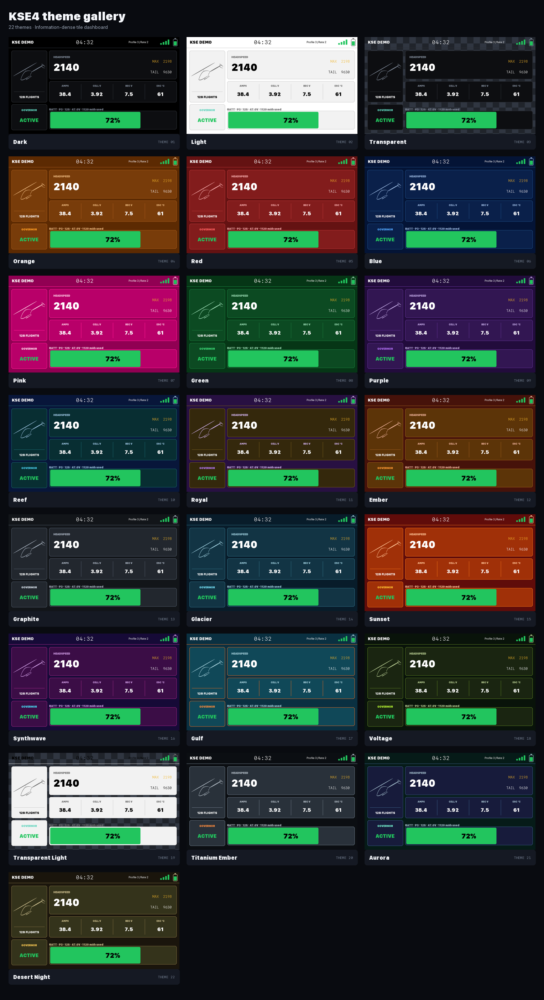
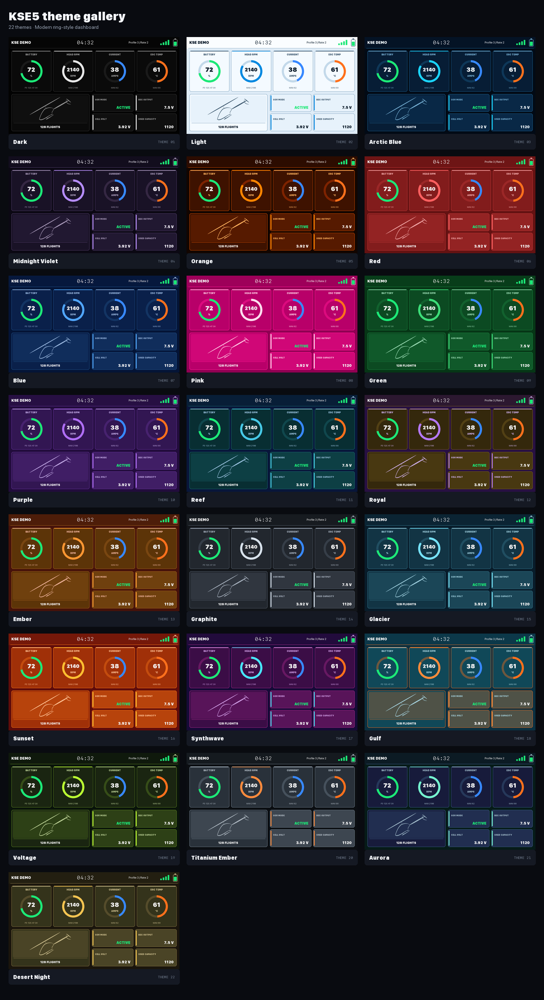

# KSE theme gallery

These preview sheets show every theme included with both dashboards. The telemetry values are illustrative; the colors are matched to the current widget source.

> **Rendering note:** These images are reference renderings, not screenshots of the widgets running on a transmitter. The actual KSE4 and KSE5 widgets are laid out slightly differently. This gallery is intended to give users a clear reference for what each theme's colors look like.

## KSE4 themes

[](assets/kse4-theme-sheet.png)

## KSE5 themes

[](assets/kse5-theme-sheet.png)

## Interactive gallery

Open [`index.html`](index.html) locally, or publish the `theme-gallery` folder with GitHub Pages. The interactive version includes widget filters, theme search, palette swatches, and individual full-resolution samples.

The committed images require no build step. Maintainers can regenerate them after changing widget palettes by running:

```bash
python3 theme-gallery/generate_previews.py
```

The generator requires Python 3 and Pillow.

After regenerating, verify that the gallery still matches the widget theme lists and source palettes:

```bash
python3 theme-gallery/validate_gallery.py
```
